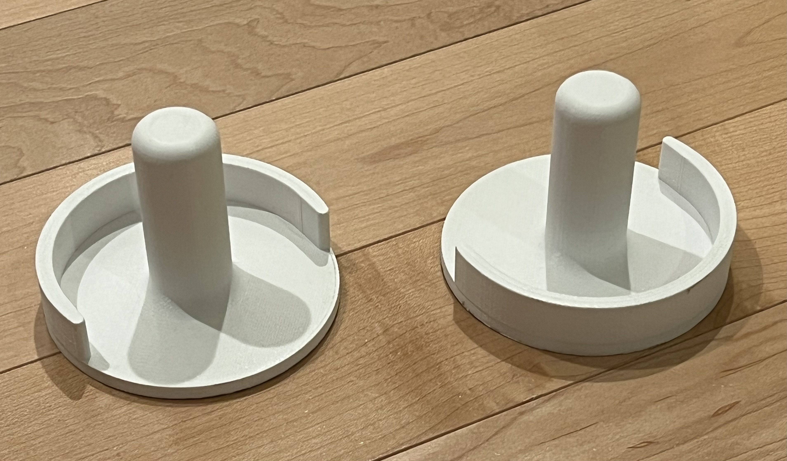
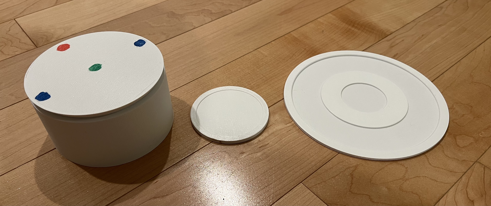

# Air-Hockey-Physics-Experiment
## Prints used for physics experiment/project in AP Physics C.
`Air Hockey Paddle.stl`: Paddle to play air hockey  
`Air Hockey Puck.stl`: Puck to play air hockey  
`Experiment Puck.stl`: Puck used in the experiment  
`Game Air Hockey Puck.stl`: Puck used for games  
`Large Air Hockey Puck.stl`: Very large puck  
`Pulley Holder.stl`: Held pulley in place on edge of table  
## Images
**Paddles**  
  
**Pucks (from left to right): Experimental puck, small puck, large puck**  
